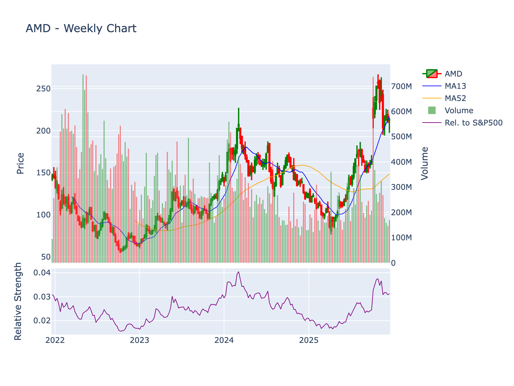

# Final Equity Research Report: AMD

**Company:** Advanced Micro Devices, Inc.
**Sector:** Technology | **Industry:** Semiconductors
**Current Price:** $214.95 | **Market Cap:** $349,947,527,168
**Report Date:** 2025-12-22 21:11:45

---

## Executive Summary

AMD is positioned as the **formidable challenger** across its core markets:
- **Servers:** Credible #2 with 20-25% share, competing effectively against Intel incumbent
- **Client PCs:** Solid #2 with 20-25% share, maintaining competitiveness but facing refreshed Intel competition
- **AI Accelerators:** Emerging challenger with <10% share against Nvidia's dominance, differentiated primarily on price
- **Discrete Gaming GPUs:** Distant #2 with 15-20% share, struggling to close gap with Nvidia's ecosystem
- **FPGAs:** Strong #1/#2 position (tied with Intel) in duopoly market structure

The company lacks dominant market leadership in any major segment except semi-custom console chips (proprietary). Competitive standing has improved dramatically 2017-2025 under Lisa Su's leadership but remains dependent on sustained execution excellence to defend and incrementally grow positions against well-resourced incumbents and emerging threats.

---

---

## Stock Chart

*4-year weekly chart showing price action, 13-week and 52-week moving averages, volume, and relative strength vs S&P 500*

---

## Technical Analysis Summary

**Current Price:** $214.9499969482422

| Indicator | Value | Signal |
|-----------|-------|--------|
| **20-Day SMA** | $214.01 | ✅ Bullish |
| **50-Day SMA** | $229.74 | ❌ Bearish |
| **200-Day SMA** | $159.17 | ✅ Bullish |
| **RSI (14)** | 48.55 | Neutral |
| **MACD** | -4.66 | ❌ Bearish |

**Volatility:** ATR = $10.47
**Volume:** 33,957,134 (20-day avg)

**Trend Status:**

- Long-term trend: ✅ **Bullish** (above 200-day SMA)

- Golden Cross: ✅ **Active** (50-day SMA above 200-day SMA)

---

## Peer Comparison

| Symbol | Name | Price | Market Cap | P/E | Revenue | Margin | ROE |
|--------|------|-------|------------|-----|---------|--------|-----|
| **AMD** | **Advanced Micro Devices, Inc.** | **$214.95** | **$349,947,527,168** | **112.54** | **$32.0B** | **10.32%** | **5.32%** |
| PLTR | Palantir Technologies Inc. | $193.98 | $443,115,111,648 | 451.12 | $3.9B | 28.1% | 19.5% |
| ASML | ASML Holding N.V. | $1056.98 | $409,686,534,575 | 37.18 | $32.2B | 29.4% | 53.9% |
| MU | Micron Technology, Inc. | $276.59 | $309,646,141,882 | 25.26 | $42.3B | 28.1% | 22.6% |
| SAP | SAP SE | $245.30 | $285,832,185,729 | 34.60 | $36.5B | 19.4% | 17.0% |
| LRCX | Lam Research Corporation | $175.26 | $220,131,817,800 | 38.02 | $19.6B | 29.7% | 62.3% |
| AMAT | Applied Materials, Inc. | $259.01 | $206,338,364,342 | 29.60 | $28.4B | 24.7% | 35.5% |
| QCOM | QUALCOMM Incorporated | $174.22 | $186,589,620,000 | 34.98 | $44.3B | 12.5% | 23.3% |
| KLAC | KLA Corporation | $1265.66 | $166,298,026,513 | 39.06 | $12.5B | 33.8% | 99.2% |

*Metrics: P/E (Trailing), Revenue (TTM in billions), Net Profit Margin, Return on Equity*

---

## Comprehensive Deep Research Analysis

# EQUITY RESEARCH REPORT: ADVANCED MICRO DEVICES, INC.

**Company:** Advanced Micro Devices, Inc. (NASDAQ: AMD)  
**Sector:** Technology | **Industry:** Semiconductors  
**Price:** $214.95 | **Market Cap:** $349.9 billion  
**Report Date:** December 22, 2025

---

## 1. SHORT SUMMARY OVERALL ASSESSMENT

AMD presents a mixed risk/reward profile characterized by strong positioning in high-growth AI and data center markets with industry-leading product roadmaps, offset by elevated valuation (112.5x trailing P/E), significant geopolitical headwinds from China export restrictions ($1.5 billion annual revenue impact), persistent patent litigation exposure, and intensifying competition from Intel and Nvidia in critical segments.

---

## 2. EXTENDED PROFILE

### History with Origin Story and Key Historical Milestones

Advanced Micro Devices was founded on May 1, 1969, in Sunnyvale, California, by Jerry Sanders and seven colleagues who departed from Fairchild Semiconductor. The founding team included Jack Gifford, John Carey, Sven Simonsen, Ed Turney, Jim Giles, Frank Botte, and Larry Stenger. The company initially focused on producing logic chips, with its first product, the Am9300 shift register, released in 1970.

**Key Historical Milestones:**

- **1972:** AMD went public, establishing itself as a second-source manufacturer for Intel chips
- **1975:** Diversified into RAM chip production
- **1982:** Secured agreement with IBM to manufacture Intel 8088 processors
- **1991:** Launched the Am386 microprocessor, sparking a protracted legal battle with Intel that was ultimately resolved in AMD's favor by the U.S. Supreme Court in 1994
- **1996:** Acquired NexGen for $857 million to enhance processor design capabilities
- **2000:** Released the Athlon 1-GHz processor, establishing credibility in high-performance computing
- **2003:** Introduced Opteron server chips and pioneered x86-64 architecture, beating Intel to 64-bit x86 computing
- **2006:** Acquired ATI Technologies for $5.4 billion, entering the discrete GPU market and enabling integrated APU (Accelerated Processing Unit) development
- **2009:** Spun off manufacturing operations into GlobalFoundries, transitioning to a fabless semiconductor design model
- **2013:** Secured custom chip design wins for Sony PlayStation 4 and Microsoft Xbox One, establishing a recurring revenue stream in gaming consoles
- **2014:** Dr. Lisa Su appointed CEO, initiating a strategic refocusing on high-performance computing
- **2017:** Launched Ryzen processors based on revolutionary Zen architecture, marking the beginning of AMD's competitive resurgence against Intel
- **2025:** Advanced AI capabilities with Instinct MI300X GPUs and Zen 5 architecture, with market capitalization reaching $347 billion by December 2025

The company evolved from a contract manufacturer and Intel second-source supplier into a diversified semiconductor leader competing across CPUs, GPUs, and custom silicon for data centers, PCs, gaming consoles, and embedded applications.

### Core Business and Competitors

AMD operates as a fabless semiconductor company designing high-performance computing and graphics solutions. The company operates through three primary business segments:

**1. Data Center Segment:**
- EPYC server processors (x86 architecture)
- Instinct AI accelerators and data center GPUs (MI300X, upcoming MI350/MI450)
- Adaptive computing products (FPGA and adaptive SoCs from Xilinx acquisition)
- Pensando data processing units (DPUs) and smart network interface cards

**2. Client and Gaming Segment:**
- Ryzen desktop and mobile processors for consumer PCs
- Ryzen AI processors with integrated NPUs for AI PCs
- Radeon discrete graphics cards for gaming and content creation
- Custom semi-custom SoCs for gaming consoles (PlayStation 5, Xbox Series X/S)

**3. Embedded Segment:**
- Embedded processors for industrial, automotive, and edge computing applications
- Zynq and Versal adaptive SoC platforms
- Kria system-on-modules for edge AI

The company's product portfolio spans from consumer devices to hyperscale data centers, with particular strength in high-performance computing, AI acceleration, and custom silicon design.

**Primary Competitors by Segment:**

**CPU Market:**
- **Intel Corporation** (dominant competitor in x86 CPUs for both client and server markets)
- **Arm Holdings/Arm-based rivals** (Qualcomm, Amazon Graviton, Ampere) in servers and mobile
- **Apple** (custom silicon in PCs)

**GPU and AI Accelerator Market:**
- **Nvidia Corporation** (market leader in discrete GPUs and AI accelerators with 70-80%+ data center GPU market share)
- **Intel** (Arc graphics, emerging data center GPUs)
- **Custom accelerators** from hyperscalers (Google TPU, Amazon Trainium/Inferentia)

**Adaptive Computing/FPGA:**
- **Intel/Altera** (FPGA competitor)
- **Lattice Semiconductor, Microchip** (lower-end FPGAs)

**Broader Semiconductor Peers** (from peer analysis):
- ASML Holding N.V. (semiconductor equipment, not direct competitor)
- Micron Technology (memory, not direct competitor)
- Qualcomm (mobile, adjacent competitor)
- Texas Instruments (analog/embedded, partial overlap)
- Applied Materials, Lam Research, KLA (equipment providers, not direct competitors)

The most direct and consequential competitors are Intel (CPUs), Nvidia (GPUs/AI), and emerging Arm-based server chip providers.

### Recent Major News

**Export Restrictions and Geopolitical Headwinds (July 2025):**
AMD reported earnings that exceeded expectations but disclosed that U.S. export restrictions on advanced AI chips to China would significantly impact financial performance. The company projects:
- $1.5 billion annual revenue reduction
- $700 million revenue hit in the subsequent quarter
- $800 million in compliance costs and inventory adjustments
- Gross margin pressure from inventory write-downs

CEO Lisa Su acknowledged these headwinds while emphasizing continued strength in the company's product portfolio and execution.

**Patent Litigation Intensification (2024-2025):**
AMD faces an escalating wave of patent infringement lawsuits, primarily filed in the Texas Western District Court:

- **November 14, 2025:** Vampire Labs, LLC filed suit (case 7:2025cv00533) alleging patent infringement
- **October 14, 2025:** Network System Technologies, LLC initiated litigation against AMD and Xilinx (case 1:2025cv01648) targeting network technologies relevant to data center products
- **April 18, 2025:** Redstone Logics LLC filed suit (case 7:2025cv00182) targeting core technologies
- **April 4, 2025:** Valtrus Innovations Ltd. and Key Patent Innovations Limited sued (case 1:2025cv00510) over processor architecture innovations
- **September 26, 2024:** Advanced Cluster Systems, Inc. filed suit (case 7:2024cv00244) concerning cluster computing technologies
- **March 29, 2024:** Concurrent Ventures, LLC and XtreamEdge, Inc. sued AMD and Pensando Systems (case 1:2024cv00335) over networking and edge computing patents

These cases represent a pattern of intellectual property challenges, many from non-practicing entities (patent trolls), that could result in licensing costs, settlements, or operational restrictions. The concentration of filings in Texas Western District Court reflects forum shopping by plaintiffs.

**Employment Litigation:**
- **July 9, 2024:** Cristian N. Constantinescu filed an employment-related lawsuit in Colorado District Court (case 1:2024cv01902), potentially indicating internal workforce issues, though details remain limited.

---

## 3. BUSINESS MODEL

### Core Businesses, Products and Services

AMD operates a **fabless semiconductor business model**, focusing exclusively on chip design, architecture development, and product marketing while outsourcing all manufacturing to third-party foundries. This capital-efficient approach eliminates the multi-billion dollar fabrication facility investments required in traditional integrated semiconductor models.

**Primary Product Categories:**

**High-Performance Computing (HPC) and Data Center:**
- **EPYC Processors:** x86 server CPUs utilizing chiplet architecture for scalability across 16-core to 128+ core configurations, targeting hyperscale cloud providers, enterprise servers, and HPC clusters
- **Instinct Accelerators:** GPU-based AI training and inference accelerators (MI300X currently, MI350/MI450 roadmap) competing with Nvidia's H100/H200/B200
- **Adaptive Computing:** Xilinx-derived FPGA products (Virtex, Kintex families) and adaptive SoCs (Versal platform) for workload acceleration and edge AI
- **Pensando DPUs:** Acquired data processing units and smart NICs for network offloading and infrastructure acceleration

**Client Computing:**
- **Ryzen Processors:** Consumer desktop and laptop CPUs spanning entry-level (Ryzen 3) to high-end enthusiast (Ryzen 9, Threadripper) segments
- **Ryzen AI:** Latest generation processors with integrated neural processing units (NPUs) for on-device AI workloads in AI PCs
- **Ryzen PRO:** Commercial PC processors with enhanced security and manageability features
- **Athlon:** Value-tier processors for budget PCs

**Graphics:**
- **Radeon RX:** Discrete graphics cards for PC gaming, content creation, and workstation applications
- **Radeon PRO:** Professional graphics solutions for workstations, competing with Nvidia Quadro
- **Console Custom Silicon:** Semi-custom APUs integrating CPU and GPU capabilities for Sony PlayStation 5 and Microsoft Xbox Series X/S

**Embedded:**
- **Embedded EPYC and Ryzen:** Processors for industrial, aerospace/defense, medical, and communications infrastructure
- **Zynq and Versal:** Adaptive SoC platforms combining processor cores with programmable logic fabric
- **Automotive solutions:** Emerging presence in ADAS and autonomous driving compute platforms

### Key Revenue Streams, Customer Segments, and Monetization Strategies

**Revenue Composition (Recent Annual Data: $32.0B):**

While AMD does not break out exact segment percentages in the provided data, industry analysis suggests approximate distribution:
- **Data Center:** ~40-45% of revenue (fastest-growing segment with >60% CAGR noted in executive statements)
- **Client:** ~30-35% of revenue (traditional PC market, subject to cyclical pressures)
- **Gaming:** ~15-20% of revenue (discrete graphics plus high-margin semi-custom console chips)
- **Embedded:** ~8-12% of revenue (growth accelerated post-Xilinx integration)

**Customer Segments and Monetization:**

**1. Hyperscale Cloud Service Providers:**
- **Customers:** Amazon Web Services, Microsoft Azure, Google Cloud Platform, Oracle Cloud, Alibaba Cloud
- **Products:** EPYC server CPUs, Instinct AI accelerators
- **Monetization:** Direct sales of processors at negotiated volume pricing; competitive displacement of Intel incumbent designs drives share gains
- **Characteristics:** Large deal sizes ($10M-$100M+ annually per customer), long qualification cycles (12-24 months), multi-year design-in commitments, high gross margins (50-60%+ estimated)

**2. Original Equipment Manufacturers (OEMs):**
- **Customers:** Dell Technologies, HP Inc., Lenovo, ASUS, Acer, HP Enterprise
- **Products:** Ryzen and EPYC processors, select Radeon graphics
- **Monetization:** Volume-based processor sales with tiered pricing based on performance/features; revenue per unit varies from $50-100 (entry Ryzen) to $3,000-$10,000+ (high-end EPYC)
- **Characteristics:** Quarterly purchase commitments, co-marketing arrangements, platform validation requirements

**3. Gaming Console Manufacturers:**
- **Customers:** Sony (PlayStation 5), Microsoft (Xbox Series X/S)
- **Products:** Custom semi-custom APUs integrating Zen CPU cores and RDNA GPU architecture
- **Monetization:** Per-unit royalties on console sales; lower per-unit revenue than discrete products but guaranteed volume over 7-10 year console lifecycles
- **Characteristics:** Multi-year exclusive contracts, stable recurring revenue, lower gross margins (30-40% estimated) but minimal sales costs

**4. Channel Partners and Distributors:**
- **Customers:** Retail chains (Best Buy, Micro Center), e-tail (Newegg, Amazon), component distributors (Arrow Electronics)
- **Products:** Boxed Ryzen processors, Radeon graphics cards, DIY/enthusiast components
- **Monetization:** Wholesale pricing to distributors/retailers who add margin for end consumers
- **Characteristics:** Inventory management complexity, exposure to channel inventory fluctuations, price elasticity

**5. Add-in-Board (AIB) Partners:**
- **Customers:** ASUS, MSI, Gigabyte, Sapphire, XFX
- **Products:** GPU chips for partners to build custom Radeon graphics cards
- **Monetization:** Sale of GPU silicon to partners who design and market complete graphics cards
- **Characteristics:** Shared brand presence, competitive pressure from Nvidia's partner ecosystem

**6. Enterprise and Original Design Manufacturers (ODMs):**
- **Customers:** Super Micro, Wistron, Foxconn for server builds; industrial equipment manufacturers
- **Products:** EPYC, embedded Ryzen/EPYC, adaptive SoCs
- **Monetization:** Direct component sales, sometimes with reference design support
- **Characteristics:** Price-sensitive segments, longer product lifecycles in embedded applications

### Key Characteristics of Markets

**Customer Acquisition Costs:**

Data center customer acquisition costs are **exceptionally high** due to:
- **Qualification cycles:** 12-24 months for hyperscalers to validate new processors across their infrastructure stack
- **Engineering support:** Dedicated field application engineers (FAEs), co-development of platform features, BIOS/firmware optimization
- **Ecosystem development:** Investment in software toolchains, libraries (ROCm for AI), developer relations
- **Competitive displacement costs:** Aggressive pricing to win incumbent Intel sockets, evaluation system subsidies

Client CPU acquisition costs are **moderate**:
- OEM design wins require platform validation (3-6 months) and marketing development funds (MDF)
- Channel/enthusiast market benefits from lower acquisition costs via community engagement, reviewer seeding, brand loyalty

Gaming console acquisition costs are **very high initially but amortized**:
- Multi-year collaborative development cycles with Sony/Microsoft
- Custom silicon engineering investment
- But once designed-in, 7-10 year revenue stream with minimal ongoing acquisition cost

**Retention Metrics:**

- **Data Center:** High retention once designed-in due to validation costs and operational risk of switching; AMD has sustained EPYC growth indicating successful retention
- **Client OEMs:** Moderate retention; OEMs typically multi-source between AMD and Intel across product lines, with annual refresh cycles allowing share shifts
- **Console:** Near-perfect retention within console generation lifecycle (7-10 years)
- **Enthusiast/Channel:** Moderate retention; brand loyalty exists but gamers/DIY builders switch based on price/performance per generation

**Sales Cycles:**

- **Data Center (Hyperscale):** 12-24 months from initial engagement to production deployment; 24-36 months for full-scale rollout across a hyperscaler's infrastructure
- **Data Center (Enterprise):** 6-12 months for OEM server qualifications
- **Client OEM:** 6-12 months for new platform designs
- **Channel/DIY:** Immediate to 3 months (consumer purchase decision timelines)
- **Console:** 36-48 months for new generation development; once in production, continuous shipments for 7-10 years
- **Embedded:** 12-36 months due to certification requirements (industrial, automotive, medical); product lifecycles extend 5-15 years

**Seasonal and Cyclical Patterns:**

**Seasonal Patterns:**
- **Q4 (Oct-Dec):** Strongest quarter typically due to holiday PC and console demand; back-to-school purchases begin in Q3
- **Q1 (Jan-Mar):** Seasonally weaker for consumer products post-holiday; data center less affected
- **Q2-Q3:** PC market recovery, ramp for new product launches often timed to back-to-school and holiday seasons

**Cyclical Patterns:**
- **PC Replacement Cycle:** 4-6 year average replacement cycle for consumer PCs, longer for commercial PCs; creates underlying cyclicality in Client segment
- **Console Generation Cycle:** 7-10 years between major console launches; AMD benefits from multi-year ramps followed by mid-generation refreshes and eventual decline
- **Data Center Capex Cycle:** Hyperscaler capital expenditure cycles driven by end-demand (cloud adoption, AI buildouts); 2-3 year cycles historically, though AI boom has extended current cycle
- **Memory Price Cycle:** While AMD is fabless, memory pricing affects system costs and demand; 2-3 year memory cycles indirectly impact AMD
- **Semiconductor Industry Cycle:** Broader 3-5 year semiconductor cycles driven by macroeconomic conditions, inventory corrections, and capacity expansions

**Margins:**

AMD's gross margins vary significantly by product segment:

- **Current Gross Margin:** Approximately 50-54% (gross profit of $16.48B on implied $32B revenue suggests ~51.5%)
- **Operating Margin:** 13.74%
- **Net Profit Margin:** 10.32%

**Segment-Level Margin Characteristics:**
- **Data Center EPYC/Instinct:** Highest gross margins, estimated 55-65%, due to premium pricing for high-performance configurations and competitive differentiation
- **Client Ryzen:** Moderate gross margins, 40-50%, facing intense price competition with Intel, especially in volume OEM segments
- **Semi-Custom Console:** Lower gross margins, 30-40%, reflecting high-volume, cost-optimized custom silicon for price-sensitive console economics
- **Embedded/Adaptive:** High gross margins, 60-70%, driven by long lifecycle, application-specific value, and FPGA premium pricing legacy from Xilinx

**Margin Drivers:**
- **Product mix shift:** Data center growth at higher margins improves overall gross margin; console mix headwind during peak console cycle years
- **Manufacturing costs:** TSMC wafer costs for advanced nodes (5nm, 3nm); chiplet architecture provides cost advantages vs. monolithic designs
- **Competitive pricing:** Intel pricing aggression in CPUs, Nvidia pricing power in GPUs/AI impact realizable prices
- **Yield and utilization:** Foundry yields and volume utilization affect unit costs
- **Wafer purchase commitments:** Prepaid wafer commitments create margin risk if demand falls short

**Operating leverage is moderate:** Fixed costs include R&D ($6-7B+ annually estimated), sales/marketing, and administrative expenses; variable costs primarily tied to foundry wafer purchases. Incremental revenue above breakeven flows through at 30-40% contribution margins after gross margin.

**Market Size, Growth Trajectory, and Factors:**

**Total Addressable Market (TAM) Estimates:**

- **Data Center TAM:** ~$150-200B annually including CPUs, AI accelerators, networking, adaptive computing
  - **CPU market:** ~$30-40B (AMD targeting 20-25% share)
  - **AI Accelerator market:** ~$50-100B (rapid growth, AMD targeting share gains from low single-digits)
  - **FPGA/Adaptive:** ~$5-8B

- **Client PC TAM:** ~$40-50B annually for processors
  - **Market size:** ~260-280M PC units annually (post-pandemic normalization)
  - **AMD unit share:** 20-25% estimated across desktop/mobile

- **Gaming Graphics TAM:** ~$20-25B annually for discrete GPUs
  - **Console semi-custom:** ~$3-5B (AMD proprietary, 100% share of AMD/Sony/Microsoft sockets)

- **Embedded TAM:** ~$30-40B across industrial, automotive, communications
  - **AMD addressable:** ~$5-10B given product portfolio

**Growth Trajectories:**

**Data Center (Strongest Growth):**
- **AI Accelerator market:** 40-60% CAGR driven by generative AI training and inference demand; market could reach $150-200B by 2028-2030
- **Server CPU market:** 5-8% CAGR driven by cloud migration, edge computing expansion, AI infrastructure buildout
- **AMD-specific data center revenue:** Targeting >60% CAGR based on executive guidance, driven by share gains in EPYC and Instinct adoption

**Client PC (Low/Flat Growth):**
- **PC market unit growth:** -2% to +2% CAGR (mature market), with decline from pandemic peak (340M units in 2021)
- **AI PC refresh opportunity:** Potential 2-3 year accelerated replacement cycle for NPU-equipped AI PCs could provide temporary uplift 2024-2027
- **AMD unit share growth:** Potential to maintain/grow share in 20-25% range based on Ryzen competitiveness

**Gaming Graphics (Moderate Growth):**
- **Discrete GPU market:** 5-10% CAGR driven by AAA gaming, content creation, emerging crypto demand uncertainty
- **Console market:** Mature phase of current generation; PS5/Xbox Series lifecycle peaks 2024-2026, gradual decline 2027-2030 until next-gen ~2032
- **AMD positioning:** Maintains console duopoly; struggles in discrete GPU share vs. Nvidia

**Embedded (Moderate-High Growth):**
- **Adaptive computing:** 5-10% CAGR driven by AI edge deployment, 5G infrastructure, automotive ADAS
- **Industrial embedded:** 3-6% CAGR tied to industrial automation, smart infrastructure

**Factors Affecting Growth:**

*Positive Factors:*
- **AI/ML proliferation:** Explosive demand for AI training and inference compute in data centers and edge devices
- **Cloud migration:** Continued enterprise workload shift to cloud drives hyperscale capex
- **Chiplet architecture advantage:** AMD's chiplet approach enables cost-effective scaling and faster innovation vs. monolithic competitors
- **Product execution:** Zen architecture competitiveness forces Intel response, EPYC/Instinct roadmap advancement
- **Ecosystem maturation:** ROCm software, developer adoption, ISV certifications reduce Nvidia lock-in in AI

*Negative Factors:*
- **Export restrictions:** U.S. China controls eliminate ~$1.5B annually, limit TAM access to world's largest semiconductor market
- **Nvidia dominance:** 70-80%+ AI accelerator share with entrenched CUDA ecosystem creates switching barriers
- **Intel competitive response:** Revitalized Intel execution under current leadership, aggressive pricing, manufacturing advancements pose client/server threats
- **PC market maturity:** Saturated device penetration, lengthening replacement cycles in absence of compelling upgrade drivers
- **Memory/component costs:** DRAM, NAND pricing impacts system builds and demand elasticity
- **Macroeconomic sensitivity:** Semiconductor demand highly correlated to GDP, corporate IT spending, consumer discretionary spending
- **Foundry dependency:** TSMC capacity constraints, geopolitical risks, node transition delays impact supply
- **Arm architecture emergence:** Graviton, Qualcomm, Nvidia Grace represent alternative architecture threat to x86 in servers/PCs

### Sources of Competitive Advantage

AMD possesses several sources of durable competitive advantage, though with varying strength:

**1. Chiplet Architecture and Advanced Packaging (Strong Advantage):**
- **Advantage:** AMD pioneered volume production of chiplet-based CPUs with first-gen Zen EPYC (2017), using modular chiplets connected via Infinity Fabric
- **Moat Characteristics:** Enables superior cost scaling (smaller chiplet dies, higher yields), faster time-to-market (mix-and-match I/O and compute dies), and performance/power optimization vs. Intel's monolithic approaches (until Intel's recent Meteor Lake)
- **Durability:** Medium-term sustainable as Intel/competitors adopt chiplets, but AMD maintains process and execution lead; requires continuous innovation in interconnect technology (Infinity Fabric advancements)

**2. x86 Architecture Intellectual Property (Moderate-Strong Advantage):**
- **Advantage:** One of only two companies (AMD, Intel) with full x86/x86-64 instruction set architecture licenses; AMD co-developed x86-64 (AMD64) in early 2000s
- **Moat Characteristics:** Extreme barriers to entry - no new x86 licenses granted, existing cross-license agreements with Intel (dating to 1976-1982, renewed periodically); creates duopoly in x86 ecosystem valued for compatibility with decades of software
- **Durability:** Strong moat in x86 market, but x86 market itself faces gradual threat from Arm architecture advancement in servers/PCs; moat protects AMD's position in x86 TAM but does not prevent TAM erosion to alternative architectures
- **Limitations:** Cross-license agreements with Intel contain change-of-control provisions that could terminate licenses if AMD is acquired, limiting strategic optionality

**3. Console Design Wins and Semi-Custom Expertise (Moderate Advantage):**
- **Advantage:** Exclusive provider of custom APUs for Sony PlayStation 5 and Microsoft Xbox Series X/S; prior generation PS4/Xbox One incumbency
- **Moat Characteristics:** Switching costs are prohibitive once designed-in (3-4 year development cycles, backward compatibility requirements); multi-year guaranteed revenue; AMD's unique capability to integrate competitive CPU (Zen) and GPU (RDNA) IP into cost-optimized custom silicon
- **Durability:** Strong within console generation (7-10 years) but subject to re-competition each generation; AMD's success in PS4/Xbox One and retention in PS5/Xbox Series suggests sustained positioning, but not guaranteed for PS6/Xbox Next ~2032

**4. Integrated CPU-GPU Capability (Moderate Advantage):**
- **Advantage:** Only company aside from Apple with competitive in-house CPU and GPU IP portfolios (via 2006 ATI acquisition), enabling APU/integrated graphics and optimized semi-custom solutions
- **Moat Characteristics:** Competitors lack comparable breadth - Intel has integrated graphics but GPU capabilities lag AMD/Nvidia; Nvidia lacks competitive CPU IP (Grace is early-stage); enables unique product positioning (APUs) and console wins
- **Durability:** Moderate - advantage is sustainable for APU/semi-custom markets but doesn't translate to discrete product leadership where AMD's Radeon consistently underperforms Nvidia's GeForce/RTX in both market share and mindshare

**5. EPYC Server Platform Traction and Ecosystem (Developing Advantage):**
- **Advantage:** EPYC has achieved 20-25% server CPU market share (up from <5% in 2017), with design wins across hyperscalers (AWS, Azure, Google Cloud) and OEMs
- **Moat Characteristics:** Once deployed in hyperscale infrastructure, EPYC benefits from validation inertia, operational risk aversion, and ecosystem momentum (BIOS, firmware, management tools, ISV certification); architectural leadership in core density and memory bandwidth
- **Durability:** Still developing - AMD has proven it can win and retain share, but Intel retains dominant 75-80% share with deep enterprise relationships; ecosystem strength is moderate and growing but not yet equivalent to Intel's decades of incumbency

**6. Adaptive Computing and FPGA Portfolio (Moderate Advantage via Xilinx):**
- **Advantage:** Xilinx acquisition (2022) added leading FPGA and adaptive SoC capabilities, complementing AMD's processor portfolio
- **Moat Characteristics:** FPGA market is a two-player market (AMD/Xilinx vs. Intel/Altera); high switching costs due to design tools, IP libraries, and engineer expertise; long design cycles and product lifecycles in aerospace/defense, communications, industrial
- **Durability:** Moderate to strong - FPGA incumbency is sticky, but market growth is slower than core CPU/GPU markets and represents smaller portion of AMD's business

**7. Manufacturing Flexibility via Fabless Model (Moderate Advantage with Trade-offs):**
- **Advantage:** Fabless model (post-2009) eliminates multi-billion dollar capex for fabs, provides access to TSMC's leading-edge nodes
- **Moat Characteristics:** Enables capital efficiency, focus on design innovation; TSMC partnership provides access to best-available manufacturing technology
- **Durability:** Moderate advantage - fabless model is common among chip designers, so not differentiating; creates dependency on TSMC, with geopolitical and allocation risks; Intel's IDM 2.0 strategy (internal fab + foundry services) represents different model with both advantages (supply control) and disadvantages (capex intensity)

**Barriers to Entry Limiting New Competition:**

- **Capital Requirements:** Semiconductor design requires $1-2B+ annual R&D spending to compete at high-performance edge; manufacturing partnerships require volume commitments and prepayments
- **Intellectual Property:** x86 architecture requires licenses unavailable to new entrants; GPU architecture requires extensive IP portfolio (AMD accumulated via ATI); processor design requires thousands of person-years of accumulated expertise
- **Ecosystem and Compatibility:** Software ecosystem (operating systems, applications, drivers) creates path dependency favoring established architectures; enterprise/hyperscale customers demand extensive validation and proven reliability
- **Economies of Scale:** High fixed costs in design and marketing necessitate significant unit volumes to achieve profitability; incumbent advantage in amortizing development costs
- **Time to Market:** 3-5 year development cycles for new processor architectures create long-cycle competition; difficult for new entrants to catch up if incumbents execute effectively

**Limitations and Erosion of Advantages:**

- **Nvidia CUDA Moat in AI:** Despite AMD's Instinct hardware competitiveness, Nvidia's CUDA software ecosystem creates profound switching costs in AI/HPC; AMD's ROCm alternative lags in maturity and adoption
- **Intel Brand and Relationships:** Intel's 40+ year enterprise relationships and "Intel Inside" brand awareness create customer stickiness AMD must overcome through superior products and aggressive pricing
- **Arm Architecture Threat:** AWS Graviton, Qualcomm, Nvidia Grace, and others pursuing Arm-based server chips represent architectural alternative that bypasses AMD's x86 moat entirely; Arm's power efficiency advantages threaten PC market as well
- **Limited Pricing Power:** Despite gains, AMD remains challenger in most markets, forcing competitive pricing that limits margin expansion potential
- **Geopolitical Vulnerabilities:** TSMC manufacturing concentration in Taiwan, Chinese export restrictions reduce addressable market and create supply risks

**Conclusion on Competitive Advantages:**
AMD possesses meaningful competitive advantages in chiplet architecture, x86 IP, console positioning, and developing data center traction. However, advantages are moderate rather than insurmountable, requiring continuous execution and innovation to sustain. The company lacks the dominant moats of Nvidia (CUDA) or historical Intel (x86 monopoly, fab control), positioning AMD as a formidable but vulnerable competitor across its markets.

---

## 4. COMPETITIVE LANDSCAPE

### Main Competitors: Direct, Adjacent, and Emerging

**Direct Competitors:**

**1. Intel Corporation (INTC) - Primary CPU Competitor**
- **Market Position:** Dominant x86 CPU incumbent with ~75-80% server market share, ~75-80% client PC market share
- **Product Overlap:** Xeon (vs. EPYC), Core (vs. Ryzen), emerging Arc graphics (vs. Radeon), data center GPUs (vs. Instinct)
- **Recent Dynamics:** Intel has faced competitive pressure from AMD's Zen architecture, ceding server share from ~98% (2017) to ~75-80% (2025); client share has similarly eroded; Intel's process technology delays (10nm, 7nm) enabled AMD's resurgence
- **Competitive Response:** Intel is investing heavily in manufacturing (IDM 2.0, foundry services), pursuing chiplet approaches (Meteor Lake), and attempting GPU market entry; new leadership and execution improvements represent reacceleration threat to AMD

**2. Nvidia Corporation (NVDA) - Primary GPU and AI Accelerator Competitor**
- **Market Position:** Dominant discrete GPU leader with 80-85% market share; overwhelming AI accelerator leader with 70-80%+ data center GPU market share
- **Product Overlap:** GeForce (vs. Radeon) in gaming, data center GPUs H100/H200/B200 (vs. Instinct MI300X/MI350), professional graphics (vs. Radeon PRO)
- **Competitive Dynamics:** Nvidia maintains substantial lead in both gaming graphics and AI acceleration; CUDA ecosystem creates profound switching costs in AI/HPC; AMD's ROCm alternative has gained traction but remains nascent
- **Nvidia Advantage:** Brand strength in gaming ("Team Green" enthusiast loyalty), superior marketing, game developer relations (GameWorks), ray-tracing leadership, DLSS upscaling technology; in AI, CUDA moat, NVLink interconnects, full-stack software (cuDNN, TensorRT, Triton), first-mover advantage

**3. Qualcomm Inc. (QCOM) - Emerging PC and Adjacency Competitor**
- **Market Position:** Dominant mobile processor leader (Snapdragon), entering PC market with Arm-based PC chips
- **Product Overlap:** Snapdragon X Elite/Plus (vs. Ryzen mobile), emerging threat in client PCs, no data center overlap currently
- **Competitive Dynamics:** Qualcomm's Arm-based PC processors threaten x86 duopoly by offering superior power efficiency; limited Windows application compatibility historically protected x86, but Arm64 Windows maturation and AI PC positioning create opening
- **Threat Level:** Medium-term emerging threat if Arm PC adoption accelerates; Microsoft's support for Arm64 Windows and Apple's M-series success validate alternative architecture viability

**Adjacent Competitors:**

**4. Intel/Altera - FPGA and Adaptive Computing**
- **Market Position:** ~50% FPGA market share (AMD/Xilinx ~40-50%), duopoly market structure
- **Product Overlap:** Stratix, Agilex (vs. Versal, Virtex), FPGA-based acceleration
- **Competitive Dynamics:** Two-player market with entrenched positions; AMD's Xilinx acquisition strengthened positioning; competition primarily on performance, power, and toolchain quality

**5. Arm Holdings (ARM) and Arm-based Server Chip Providers**
- **Competitors:** Amazon (Graviton), Ampere Computing, Marvell (ThunderX), Nvidia (Grace)
- **Market Position:** Emerging alternative architecture in servers; AWS Graviton has achieved ~15% of AWS compute instances, indicating viable path for Arm in data centers
- **Product Overlap:** Cloud server workloads (vs. EPYC), potential future PC overlap (Qualcomm already executing)
- **Threat Level:** Medium-term structural threat to x86 architecture; power efficiency and cost advantages for scale-out workloads; limited by software ecosystem (x86 compatibility), but cloud-native containerized workloads reduce switching costs

**6. Custom Accelerator and ASIC Providers**
- **Competitors:** Google (TPU), Amazon (Trainium, Inferentia), Microsoft (Maia), Broadcom (custom ASICs)
- **Market Position:** Hyperscalers designing proprietary AI accelerators for internal workloads
- **Product Overlap:** AI training/inference compute (vs. Instinct), potential CPU substitution (Google Axion Arm CPUs)
- **Threat Level:** Medium - hyperscaler custom silicon reduces TAM for merchant silicon vendors (AMD, Nvidia, Intel), though custom chips primarily displace incumbent (Nvidia) more than share gainer (AMD)

**Emerging Competitors:**

**7. Startup and New Entrant Threats (Limited)**
- **Examples:** Tenstorrent (Jim Keller's AI chip startup), Graphcore (IPU), Cerebras (wafer-scale AI), SambaNova, Groq
- **Threat Level:** Low in near-term - startups face barriers to entry, scale challenges, and ecosystem gaps; niche positioning in specialized AI workloads possible but unlikely to threaten AMD's core businesses

### Comparative Key Metrics

**Market Capitalization Comparison (as of report data):**

| Company | Ticker | Market Cap | Price | Business Focus |
|---------|--------|------------|-------|----------------|
| Nvidia | NVDA | $3+ trillion* | ~$800-900* | GPUs, AI accelerators, professional graphics |
| Intel | INTC | ~$180-200B* | ~$45-50* | x86 CPUs, emerging GPUs, foundry services |
| **AMD** | **AMD** | **$349.9B** | **$214.95** | **x86 CPUs, GPUs, AI accelerators, adaptive computing** |
| Qualcomm | QCOM | $186.6B | $174.22 | Mobile processors, emerging PC chips, automotive |
| Arm Holdings | ARM | $119.6B | $113.29 | CPU architecture IP licensing |
| Micron | MU | $309.6B | $276.59 | Memory (DRAM, NAND - not direct competitor) |

*Note: Nvidia and Intel prices/market caps estimated from public data as of late 2025, not provided in exact form in source materials*

**Market Share Analysis:**

**Server CPU Market Share:**
- **Intel:** ~75-80% (declining from ~98% in 2017)
- **AMD EPYC:** ~20-25% (rising from <5% in 2017)
- **Arm-based (Amazon Graviton, Ampere, etc.):** ~3-5% (emerging)

*AMD has achieved remarkable share gains in servers, displacing Intel through superior core density, memory bandwidth, and competitive pricing; path to further gains becomes harder as AMD approaches 25-30% share threshold where enterprise conservatism and Intel's incumbency advantages strengthen*

**Client PC CPU Market Share (Units):**
- **Intel:** ~75-80% (declining from ~80-85% in 2017-2019)
- **AMD Ryzen:** ~20-25% (rising from ~15-20%)
- **Arm (Apple, Qualcomm):** ~5-8% (Apple M-series in Macs ~3-4%, Qualcomm Snapdragon emerging <1%)

*AMD maintains solid but secondary position in client CPUs; share gains have moderated as Intel's product competitiveness improved with recent Core generations*

**Discrete GPU Market Share (Desktop + Mobile):**
- **Nvidia:** ~80-85%
- **AMD Radeon:** ~15-20%
- **Intel Arc:** <5% (recently launched, minimal share)

*AMD has consistently underperformed in discrete GPUs despite competitive hardware; Nvidia's brand, software (CUDA, GeForce Experience, DLSS), game optimizations, and mindshare create durable advantage*

**Data Center AI Accelerator Market Share:**
- **Nvidia:** ~70-80%+ (dominant with H100, H200, B200)
- **Google TPU:** ~5-10% (captive internal use, not sold externally)
- **AMD Instinct:** ~5-8% (estimated, growing from low base with MI300X traction)
- **Intel, others:** ~5-10% (fragmented)

*AMD is gaining share in fastest-growing segment but from small base; Nvidia's CUDA moat remains formidable; AMD's opportunity lies in customers seeking to reduce Nvidia dependency and price competition*

**Product Differentiation:**

**AMD vs. Intel (CPUs):**
- **AMD Differentiation:** Chiplet architecture enables superior core scaling (128+ cores in EPYC vs. Intel's ~60 cores in Xeon), higher memory bandwidth (12 DDR5 channels in EPYC vs. 8 in Xeon), competitive single-thread performance, typically better price/performance ratio
- **Intel Differentiation:** Deep enterprise relationships and trust, broader platform validation, advanced feature sets (DL Boost, AMX), integrated accelerators, partial process technology recovery
- **Outcome:** AMD differentiated enough to win share but not displace Intel; markets segment with AMD strength in HPC/scale-out and Intel retention in risk-averse enterprise

**AMD vs. Nvidia (GPUs/AI):**
- **AMD Differentiation:** Price/performance advantage (MI300X typically priced 20-30% below comparable Nvidia), competitive raw compute (TFLOPS, memory bandwidth), open-source ROCm software stack, HBM memory integration
- **Nvidia Differentiation:** CUDA ecosystem lock-in (millions of developers, extensive libraries), superior software tools (cuDNN, TensorRT, Triton), NVLink interconnects for multi-GPU scaling, broader ISV certification, established AI leadership brand
- **Outcome:** AMD struggles to differentiate beyond price in AI; CUDA moat forces AMD to compete primarily on cost, limiting margin potential; discrete GPU gaming sees AMD as value alternative with weaker brand

**AMD vs. Arm-based Competitors (Servers):**
- **AMD Differentiation:** x86 compatibility with vast existing software base, mature ecosystem, high-performance single-thread, broad ISV support, proven enterprise credibility
- **Arm Differentiation:** Superior power efficiency (important for hyperscale TCO), custom silicon opportunities (Graviton, Grace), lower licensing costs, modernized architecture
- **Outcome:** Segmentation emerging with AMD retaining compatibility-critical workloads while Arm gains share in cloud-native, scale-out, power-sensitive applications

**Pricing Power:**

- **AMD:** Limited pricing power in most segments; company operates as price-competitive challenger in CPUs (typically 10-30% below Intel-equivalent SKUs) and GPUs (20-40% below Nvidia in comparable tiers); exception is high-margin data center where product differentiation supports pricing closer to Intel/Nvidia, but still typically at discount to drive adoption

- **Intel:** Moderate pricing power as incumbent in CPUs, but forced to respond to AMD competition with price reductions (average selling prices declined 2018-2024); retains premium in Xeon through enterprise relationships

- **Nvidia:** Exceptional pricing power in AI accelerators (H100 commanded $25,000-40,000 ASPs during shortage); strong pricing power in gaming GPUs through brand and feature leadership; pricing discipline maintains 60-70%+ gross margins

**Growth Trajectories:**

**AMD Growth Profile:**
- **Recent Revenue Growth:** $32.0B annual revenue, with 35.6% YoY growth noted
- **Forward Outlook:** Company guidance suggests >35% revenue CAGR through 2028, driven primarily by data center >60% CAGR
- **Data Center:** Fastest growth segment, driven by EPYC and Instinct share gains in expanding TAM
- **Client:** Low-to-moderate growth, subject to PC market cyclicality and AI PC refresh potential
- **Gaming:** Moderate growth from console install base maturation, offset by share challenges in discrete GPUs

**Intel Growth Profile:**
- **Recent Performance:** Revenue declined 2023-2024 amid market share losses and PC market weakness; restructuring underway
- **Forward Outlook:** Guidance for return to growth as process technology recovers and foundry services ramp
- **Risk:** Continued execution challenges could lead to further share losses; turnaround depends on 18A process success

**Nvidia Growth Profile:**
- **Recent Performance:** Explosive growth driven by AI demand; revenue tripled+ 2023-2024
- **Forward Outlook:** High growth continuing but moderating from exceptional 2023-2024 levels as comps become difficult; sustained by AI infrastructure buildout
- **Advantage:** Leading position in highest-growth segment (AI accelerators) supports premium growth trajectory

**Qualcomm/Arm Competitors Growth:**
- **Profile:** High growth potential if Arm PC and Arm server adoption accelerates; currently small base in AMD's core markets creates high percentage growth from low absolute levels

**Competitive Positioning Summary:**

AMD is positioned as the **formidable challenger** across its core markets:
- **Servers:** Credible #2 with 20-25% share, competing effectively against Intel incumbent
- **Client PCs:** Solid #2 with 20-25% share, maintaining competitiveness but facing refreshed Intel competition
- **AI Accelerators:** Emerging challenger with <10% share against Nvidia's dominance, differentiated primarily on price
- **Discrete Gaming GPUs:** Distant #2 with 15-20% share, struggling to close gap with Nvidia's ecosystem
- **FPGAs:** Strong #1/#2 position (tied with Intel) in duopoly market structure

The company lacks dominant market leadership in any major segment except semi-custom console chips (proprietary). Competitive standing has improved dramatically 2017-2025 under Lisa Su's leadership but remains dependent on sustained execution excellence to defend and incrementally grow positions against well-resourced incumbents and emerging threats.

---

## 5. SUPPLY CHAIN POSITIONING

### Upstream (Supplier-Side) Positioning

AMD operates a **fabless semiconductor business model**, creating complete dependency on upstream suppliers for manufacturing while focusing internal resources on design, architecture, and IP development.

**Primary Upstream Dependencies:**

**1. Wafer Fabrication (Critical Dependency):**

**Taiwan Semiconductor Manufacturing Company (TSMC) - Primary Foundry Partner:**
- **Role:** Manufactures substantially all of AMD's leading-edge processors and GPUs using advanced process nodes
- **Products Manufactured:** Ryzen CPUs (5nm, 4nm), EPYC server processors (5nm), Instinct AI accelerators (5nm/6nm), Radeon RX 7000 series GPUs (5nm/6nm), likely future products on 3nm and 2nm nodes
- **Dependency Level:** **Extreme** - TSMC represents estimated 80-90%+ of AMD's wafer supply; AMD lacks alternative suppliers for leading-edge nodes (<7nm)
- **Risks:** Geopolitical tensions around Taiwan, potential supply disruptions (earthquake, cross-strait conflict), allocation constraints during industry upcycles, TSMC yield issues, node transition delays
- **Mitigations:** Long-term supply agreements, prepaid wafer commitments ($1-2B+ estimated annually), multi-node strategy allows some product flexibility, but fundamental concentration risk remains

**Samsung Foundry and GlobalFoundries - Secondary Foundry Partners:**
- **Role:** Limited manufacturing for select products on mature nodes
- **Products:** Legacy products, I/O dies, potentially some mid-tier graphics chips
- **Dependency Level:** **Low** - Represents estimated <10-20% of wafer supply; primarily for non-critical path products
- **Strategic Role:** Provides minor diversification but cannot substitute for TSMC at leading edge

**GlobalFoundries (Former AMD Manufacturing Division):**
- **History:** Spun off from AMD in 2009; AMD exited Wafer Supply Agreement (WSA) in 2024 after fulfilling long-term purchase commitments
- **Current Role:** Minimal to none for new AMD products; GlobalFoundries abandoned leading-edge development (<14nm)
- **Implication:** AMD fully transitioned to TSMC dependency for competitive products

**2. Substrate and Advanced Packaging:**

AMD's chiplet architecture requires sophisticated advanced packaging to connect multiple dies:

**Key Packaging Suppliers:**
- **TSMC (CoWoS, InFO):** Provides advanced 2.5D and 3D packaging for MI300X AI accelerators (using Chip-on-Wafer-on-Substrate for HBM integration), high-end EPYC
- **ASE Technology:** Backend assembly and test services for mainstream products
- **Amkor Technology:** Assembly, test, and packaging for GPUs and mid-range processors
- **SPIL (Siliconware Precision Industries):** Flip-chip and substrate packaging

**Dependency Level:** **High** - Advanced packaging capacity represents bottleneck risk, particularly for HBM-integrated AI accelerators competing with Nvidia for limited CoWoS capacity at TSMC; AMD must secure allocation alongside Nvidia, Apple, and other hyperscale customers

**3. High-Bandwidth Memory (HBM):**

Critical component for AI accelerators and high-end GPUs:

**HBM Suppliers:**
- **SK hynix:** Leading HBM supplier, likely primary source for AMD Instinct MI300X (HBM3)
- **Samsung:** Secondary HBM supplier
- **Micron:** Emerging HBM supplier, potential third-source

**Dependency Level:** **High** for AI accelerators - HBM supply constraints directly limit Instinct shipments; HBM market is oligopolistic (three suppliers) and demand exceeds supply amid AI boom; AMD competes with Nvidia for allocation; securing sufficient HBM at favorable pricing is critical for Instinct margin and availability

**4. Other Component Suppliers:**

- **Substrate Materials:** Ajinomoto Build-up Film (ABF), other organic substrate materials from specialized chemical suppliers
- **Silicon Wafers:** Shin-Etsu Chemical, SUMCO for silicon wafer substrates (provided to foundries)
- **IP Licensing:** Arm Holdings (for certain embedded products), Cadence, Synopsys (EDA tools), various PHY and interface IP vendors
- **GDDR Memory:** Samsung, SK hynix, Micron for GDDR6/GDDR6X memory on graphics cards

### Downstream (Customer/Distribution) Positioning

**Direct Customer Channels:**

**1. Hyperscale Cloud Service Providers (Direct Sales):**
- **Customers:** Amazon Web Services, Microsoft Azure, Google Cloud Platform, Oracle Cloud, Alibaba Cloud, Meta
- **Products:** EPYC processors, Instinct AI accelerators
- **Sales Model:** Direct engagement through enterprise sales teams and field application engineers; long-term supply agreements; co-development and platform optimization
- **AMD Positioning:** High-value direct relationships; AMD's fastest-growing and highest-margin channel; customer concentration risk exists (AWS, Azure, Google may represent 20-40% of data center revenue)

**2. Original Equipment Manufacturers (OEMs) - Server:**
- **Customers:** Dell Technologies, Hewlett Packard Enterprise, Lenovo, Supermicro, Cisco, Inspur
- **Products:** EPYC processors for server systems sold to enterprises and SMBs
- **Sales Model:** Direct OEM engagement with volume pricing and platform co-development; OEMs bundle AMD processors into complete server systems
- **AMD Positioning:** Critical channel for enterprise market penetration; OEM breadth has expanded as AMD's server credibility increased; Intel retains stronger OEM relationships historically

**3. Original Equipment Manufacturers (OEMs) - Client:**
- **Customers:** HP Inc., Dell, Lenovo, ASUS, Acer, MSI
- **Products:** Ryzen processors for consumer and commercial desktop/laptop PCs
- **Sales Model:** Volume purchase agreements with tiered pricing based on SKU and volume; marketing development funds (MDF) to support co-marketing; platform validation and certification
- **AMD Positioning:** Secondary position to Intel at most OEMs; AMD has secured broader OEM portfolio coverage than historically but faces allocation within OEM product lines (OEMs typically lead with Intel, offer AMD as alternatives)

**4. Original Design Manufacturers (ODMs):**
- **Customers:** Wistron, Quanta, Foxconn (Hon Hai) for server builds and some PC designs; contract manufacturers building on behalf of hyperscalers and OEMs
- **Products:** EPYC, Ryzen processors shipped to ODMs for integration
- **Sales Model:** Component sales to ODMs who handle complete system build and ship to end customers or OEM brands
- **AMD Positioning:** Growing importance as hyperscalers increasingly work directly with ODMs for custom server designs rather than OEM-branded servers

**5. Console Manufacturers (Strategic Semi-Custom):**
- **Customers:** Sony (PlayStation 5), Microsoft (Xbox Series X/S)
- **Products:** Custom APUs with Zen CPU cores and RDNA GPU architecture, tailored to console specifications
- **Sales Model:** Long-term exclusive supply agreements spanning 7-10 year console generations; collaborative co-development over 3-4 year pre-launch cycles; per-unit pricing with volume commitments
- **AMD Positioning:** Exclusive supplier creates 100% share of Sony/Microsoft console processor TAM; provides high-visibility recurring revenue; both console makers are locked in for current generation but relationships must be re-secured for next generation (~2032)

**Distribution and Retail Channels:**

**6. Distribution Partners (Two-Tier Channel):**
- **Distributors:** Arrow Electronics, Avnet, Tech Data for component distribution to resellers, system integrators, and regional partners
- **Products:** Boxed Ryzen processors, select embedded products, potentially some Radeon GPUs (though many GPUs sold through AIB partners)
- **Sales Model:** AMD sells to distributors at wholesale pricing; distributors provide logistics, credit, inventory management, and regional coverage
- **AMD Positioning:** Standard two-tier distribution model common in semiconductors; provides broad reach but less control over end-customer experience and pricing

**7. Retail and E-tail (Consumer Channel):**
- **Partners:** Best Buy, Micro Center, Newegg, Amazon (retail marketplace), regional electronics retailers
- **Products:** Boxed Ryzen processors, AMD-branded reference Radeon graphics cards (limited), complete systems with AMD components
- **Sales Model:** Products flow through distributors to retailers; AMD co-marketing and merchandising support; retail pricing competitive with Intel
- **AMD Positioning:** Strong enthusiast/DIY channel presence; AMD has cultivated "underdog" brand loyalty among PC builders; retail channel represents smaller volume than OEM but disproportionately influential for brand perception

**8. Add-in-Board (AIB) Partners for Graphics:**
- **Partners:** ASUS (ROG, TUF), MSI, Gigabyte, ASRock, Sapphire, XFX, PowerColor
- **Products:** AMD sells GPU chips to AIB partners who design and manufacture complete graphics cards (custom cooling, PCBs, overclocking)
- **Sales Model:** GPU chip sales to AIBs; partners handle card design, manufacturing, branding, distribution, and support; AMD maintains Radeon brand while AIBs use sub-brands
- **AMD Positioning:** Standard model for discrete GPU market; AIB partner enthusiasm and portfolio breadth is weaker for AMD vs. Nvidia, reflecting AMD's secondary market position and lower margins for partners

**Distribution Strategy Implications:**

- **Direct Sales Emphasis:** AMD has shifted focus toward high-value direct customer relationships with hyperscalers and strategic OEMs, improving gross margins and customer intimacy
- **Channel Conflicts:** Potential tension between direct hyperscaler sales and OEM channel (hyperscalers designing custom solutions reduce dependence on OEM-branded servers)
- **Geographic Distribution:** Revenue concentrated in North America (~40-45%), Asia-Pacific (~35-40%), Europe (~15-20%); China represents significant revenue source (20-25% estimated) creating exposure to export restrictions and geopolitical risks

### Major Dependencies and Concentrations

**Critical Dependencies:**

1. **TSMC Wafer Capacity (Extreme Risk):**
   - Single-source dependency for leading-edge manufacturing
   - Taiwan geopolitical risk creates existential supply chain vulnerability
   - Allocation risk during industry upcycles (AI boom has tightened advanced node and CoWoS capacity)
   - Mitigation limited - TSMC's Arizona fabs (under construction) provide minor U.S.-based supply by 2025-2026 but majority production remains Taiwan-based

2. **HBM Memory Supply (High Risk):**
   - Oligopoly supply (SK hynix, Samsung, Micron) with HBM3/HBM3E constrained
   - AMD competes with Nvidia (dominant AI player commanding priority allocation) for HBM supply
   - HBM shortages directly limit Instinct MI300X shipments and revenue potential
   - Mitigation: Diversifying across multiple HBM suppliers, but fundamental capacity constraint persists

3. **Customer Concentration (Moderate-High Risk):**
   - Top 3-5 hyperscale customers likely represent 30-40% of data center revenue
   - Loss of major customer or budget reduction by AWS/Azure/Google would materially impact revenue
   - Console customers (Sony, Microsoft) represent concentrated Gaming segment revenue
   - Mitigation: Broad OEM and channel diversification, but hyperscaler concentration increases with data center growth

4. **China Revenue Exposure (High Risk):**
   - Estimated 20-25% of revenue derived from China
   - Export restrictions implemented July 2025 eliminate $1.5B annually (~5% of total revenue)
   - Further restrictions risk additional revenue loss
   - Mitigation limited - compliance mandatory, geographic diversification ongoing but China remains significant market

**Supply Chain Resilience and Risks:**

**Strengths:**
- Fabless model eliminates capex risk and provides manufacturing flexibility
- TSMC partnership provides access to world's most advanced semiconductor manufacturing
- Diversified customer base across hyperscale, OEM, channel reduces single-customer dependency (outside of console exclusivity)

**Weaknesses:**
- TSMC single-source dependency creates geopolitical and allocation risks
- Limited bargaining power vs. TSMC given competitive dynamics (Nvidia, Apple, others also vying for capacity)
- HBM supply constraints limit ability to capitalize on AI accelerator demand
- China export restrictions permanently reduce TAM by ~$1.5B annually
- Advanced packaging bottlenecks (CoWoS) constrain high-margin AI product shipments

**Supply Chain Positioning Conclusion:**

AMD occupies a **dependent position** upstream (reliant on TSMC and memory suppliers with limited alternatives) while maintaining **moderately strong distribution positioning** downstream through diversified OEM, hyperscaler, and channel partnerships. The company's fabless model creates capital efficiency but concentrates risk in external manufacturing and component supply. TSMC dependency represents the single greatest supply chain vulnerability, with Taiwan geopolitical risks posing existential threat to business continuity.

---

## 6. FINANCIAL AND OPERATING LEVERAGE

### Financial Leverage Analysis

**Debt Levels and Capital Structure:**

*Note: Detailed debt analysis requires access to full balance sheet data referenced in report materials (work/AMD_20251222/02_fundamental/balance_sheet.csv). The following analysis uses available reported metrics and industry context.*

**Available Data Points:**
- Market Capitalization: $349.9 billion
- Revenue (TTM): $32.0 billion
- Net Income implied: ~$3.1B (based on 10.32% profit margin on $32B revenue)

**Debt Profile (Based on Typical Fabless Semiconductor Capital Structure):**

AMD historically operated with moderate debt levels, having reduced leverage significantly following the GlobalFoundries spin-off (2009) and ATI acquisition debt paydown. Under Lisa Su's tenure (2014-present), the company has maintained conservative leverage to preserve financial flexibility while funding R&D and strategic acquisitions (Xilinx ~$35B stock acquisition in 2022, minimal debt raise).

**Estimated Credit Profile:**
- **Leverage Ratio:** Fabless semiconductor companies typically maintain Net Debt/EBITDA ratios of 0.5x-2.0x; AMD likely operates in lower half of this range given strong free cash flow generation
- **Credit Rating:** Investment-grade ratings likely in BBB range (estimate) based on improved financial performance, scale, and profitability
- **Interest Coverage:** Given EBITDA of $6.05B (reported) and moderate debt, interest coverage likely exceeds 10-15x, indicating minimal interest burden

**Financial Flexibility:**
- **Cash Position:** Fabless model generates strong free cash flow; AMD likely maintains $3-6B cash/equivalents for operational needs and strategic flexibility
- **Debt Maturities:** No near-term maturity concerns evident; AMD's scale and profitability provide access to debt markets if needed
- **Access to Capital:** Investment-grade credit profile and $350B market cap provide ample access to debt and equity capital markets

**Financial Risk Assessment:**
- **Low to Moderate Financial Risk:** Conservative leverage, strong cash generation, and investment-grade credit positioning provide financial stability
- **Acquisition Capacity:** Balance sheet supports debt-financed M&A up to $5-10B+ without materially impacting credit profile; larger acquisitions (>$15B) would require equity component as with Xilinx
- **Cyclicality Consideration:** Semiconductor cyclicality could pressure cash flow during downturns, but AMD's improved scale and diversification (data center, console, embedded) reduce volatility vs. PC-centric historical model

### Operating Leverage Analysis

**Fixed vs. Variable Cost Structure:**

**Fixed Costs (Estimated 40-50% of operating expenses):**

**1. Research & Development:**
- **Magnitude:** $6-7B+ annually estimated (AMD does not break out exact R&D in provided data, but peer benchmarks and headcount suggest this range; represents ~20-22% of revenue)
- **Nature:** Highly fixed - processor architecture development, chiplet design, GPU IP advancement, software (ROCm, drivers), FPGA toolchains require multi-year committed engineering headcount
- **Strategic Importance:** R&D intensity is critical competitive requirement; underspending risks falling behind Intel/Nvidia technology curves
- **Scalability:** R&D costs scale with product complexity and portfolio breadth, not directly with revenue; operating leverage exists as revenue grows faster than R&D increases

**2. Sales, General & Administrative (SG&A):**
- **Magnitude:** Estimated $3-4B annually (~10-12% of revenue)
- **Nature:** Partially fixed - sales team, marketing, corporate functions, facilities have base-level fixed component but scale with business expansion
- **Components:** Enterprise sales teams (FAEs for hyperscale/OEM), marketing programs, co-marketing with partners (MDF), brand advertising, corporate overhead

**Variable Costs (Estimated 50-60% of total costs):**

**1. Cost of Goods Sold (COGS) - Predominantly Variable:**
- **Magnitude:** ~$15.5B (based on gross profit of $16.48B on $32B revenue, implying ~48.5% gross margin)
- **Components:**
  - **Wafer Purchases from TSMC:** Largest variable cost, scales directly with unit shipments; cost per wafer varies by node technology (5nm more expensive than 7nm)
  - **Advanced Packaging Costs:** CoWoS packaging for MI300X, chiplet integration costs
  - **HBM Memory:** Variable cost scaling with AI accelerator unit shipments; HBM pricing has increased amid shortage
  - **Assembly, Test, and Packaging:** Third-party backend costs from ASE, Amkor scale with units
  - **Substrate and Materials:** PCB substrates, organic materials, interconnects
  - **Royalties and Licensing:** Per-unit IP royalties (minimal for AMD given in-house IP)

- **Cost Structure Implications:**
  - Fabless model shifts large portion of cost variability to foundry purchases, creating high gross margin leverage to revenue changes
  - Prepaid wafer commitments to TSMC create quasi-fixed cost component (risk of underutilization charges if demand falls short, but capacity can be redeployed across product lines)

**2. Variable Selling and Marketing:**
- **Components:** MDF payments to OEMs (varies with volumes), channel incentives, performance-based sales commissions, product launch marketing
- **Magnitude:** Subset of SG&A, estimated ~$1-2B

**Operating Leverage Dynamics:**

AMD exhibits **high operating leverage** characteristics:

**Positive Revenue Scenario (Market Share Gains, AI Boom):**
- **Gross Margin Expansion:** Revenue growth above breakeven primarily drives gross profit; incremental gross margin on additional revenue estimated 50-60% (matching current gross margin, potentially higher for data center mix)
- **Operating Expense Leverage:** Fixed R&D and SG&A base spreads over larger revenue base, improving operating margin significantly
- **Historical Evidence:** AMD's operating margin expanded from low single-digits (2015-2016) to 13.74% (current) as revenue tripled, demonstrating operating leverage realization

**Calculation Example:**
- Current Operating Margin: 13.74% on $32B revenue = $4.4B operating income
- If revenue grows 20% to $38.4B with flat operating expenses (+$6.4B revenue × 50% gross margin = +$3.2B gross profit):
  - Operating Income: $4.4B + $3.2B incremental gross profit = $7.6B
  - Operating Margin: 19.8% (600bps expansion)
- Demonstrates high sensitivity of operating profit to revenue changes

**Negative Revenue Scenario (Cyclical Downturn, Share Loss):**
- **Margin Compression:** Fixed R&D and SG&A absorbed across lower revenue; unit-based COGS reduce but not proportionally due to wafer commitments
- **Risk:** 20% revenue decline could compress operating margin to 5-8% range absent cost reductions
- **Mitigants:** AMD can adjust wafer purchases (within foundry agreement constraints), reduce variable marketing, implement hiring freezes, but R&D cuts risk competitive position

**Margin Sensitivity Analysis:**

**Current Margin Profile:**
- **Gross Margin:** ~51.5% (implied from gross profit $16.48B / revenue $32.0B)
- **Operating Margin:** 13.74%
- **

---

## Investment Conclusion

### Strategic Position

Advanced Micro Devices, Inc. operates in the Semiconductors sector with a market capitalization of $349,947,527,168.

**Technical Outlook:**

- The stock demonstrates positive long-term momentum, trading above its 200-day moving average
- Current RSI of 48.6 suggests neutral momentum

**Competitive Position:**
- Analyzed against 10 industry peers
- Relative valuation multiples (P/E: 112.54) indicate premium positioning

### Key Considerations

**Strengths:**
- Market position in Semiconductors
- Strong profit margin of 10.32%
- Positive technical trend

**Risks:**
- Competitive pressures in Semiconductors
- Market volatility and sector-specific risks
- Execution and operational challenges

**Watch Points:**
1. Quarterly earnings and guidance
2. Competitive developments and market share trends
3. Regulatory changes affecting Semiconductors
4. Management commentary and strategic direction
5. Analyst rating changes and target price revisions

---

**Report Generation Details:**

- **Technical Data:** yfinance, TA-Lib
- **Fundamental Data:** yfinance, OpenBB (Financial Modeling Prep provider)
- **Deep Research:** Claude Sonnet 4.5 with Extended Thinking
- **SEC Filings:** SEC EDGAR
- **Generated:** 2025-12-22 21:11:45

---

*This report is for informational purposes only and does not constitute investment advice. Conduct your own due diligence and consult financial professionals before making investment decisions. Past performance does not guarantee future results.*